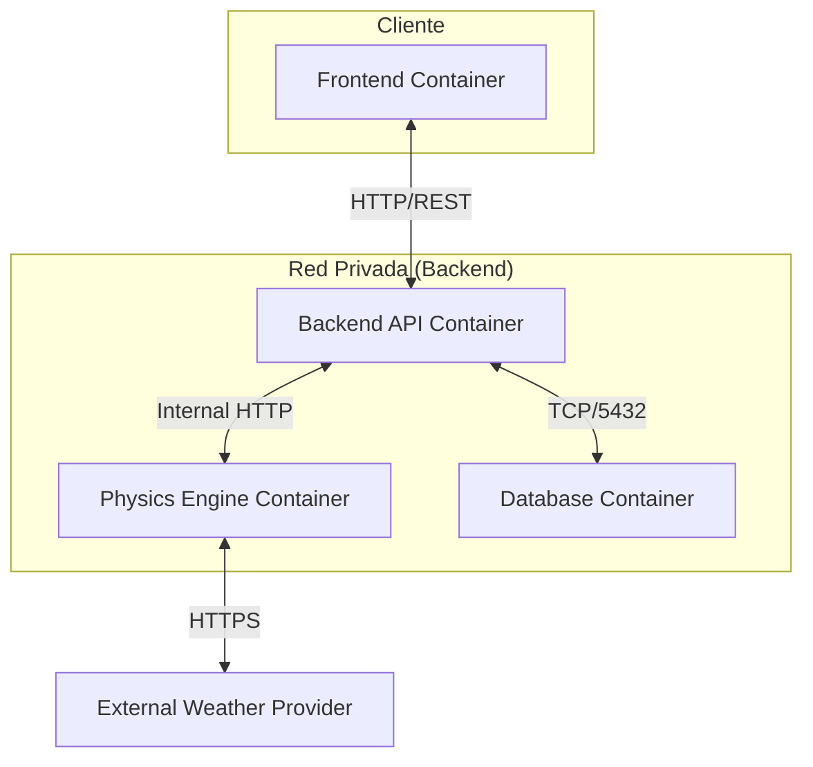

# Arquitectura y Diseño Técnico del Simulador de Energías Renovables

Este documento detalla las decisiones de arquitectura, patrones de diseño, flujos de datos y estructura operativa del sistema. Su propósito es proporcionar una referencia técnica para desarrolladores e ingenieros de software sobre la implementación del simulador.

---

## Índice de Contenidos

1.  [Principios de Diseño](#1-principios-de-diseño)
2.  [Arquitectura de Servicios](#2-arquitectura-de-servicios)
    *   [Justificación del Desacoplamiento del Motor de Cálculo](#justificación-del-desacoplamiento-del-motor-de-cálculo)
    *   [Backend como Capa de Orquestación](#backend-como-capa-de-orquestación)
3.  [Componentes del Sistema](#3-componentes-del-sistema)
    *   [3.1 Capa de Presentación (Frontend)](#31-capa-de-presentación-frontend)
    *   [3.2 Capa de Orquestación y Negocio (Backend)](#32-capa-de-orquestación-y-negocio-backend)
    *   [3.3 Motor de Cálculo Científico (Physics Engine)](#33-motor-de-cálculo-científico-physics-engine)
    *   [3.4 Capa de Persistencia (Base de Datos)](#34-capa-de-persistencia-base-de-datos)
4.  [Flujos de Datos](#4-flujos-de-datos)
5.  [Organización del Código Fuente](#5-organización-del-código-fuente)
6.  [Infraestructura y Despliegue](#6-infraestructura-y-despliegue)

---

## 1. Principios de Diseño

El sistema se ha construido priorizando tres atributos de calidad: **Rendimiento en Computación Intensiva**, **Integridad Referencial de Datos Temporales** y **Desacoplamiento Funcional**.

### Desafíos Técnicos
La simulación de proyectos energéticos presenta requisitos no funcionales específicos:
1.  **Volumen de Datos Temporales:** El análisis de viabilidad requiere una granularidad horaria a lo largo de 20-25 años, generando aproximadamente 220,000 registros por variable simulada.
2.  **Carga Computacional:** Los modelos físicos implican operaciones vectoriales y matriciales complejas sobre grandes datasets, lo cual es computacionalmente costoso (CPU-bound).
3.  **Almacenamiento Optimizado:** La persistencia y consulta eficiente de estos datos requiere optimizaciones específicas para series temporales.

### Estrategia de Implementación
Se ha adoptado una arquitectura de microservicios heterogénea, seleccionando la tecnología óptima para cada dominio del problema.

---

## 2. Arquitectura de Servicios

El sistema se despliega mediante contenedores Docker interconectados.



### Justificación del Desacoplamiento del Motor de Cálculo

La separación del motor de física en un servicio independiente escrito en Python es una decisión crítica basada en:

#### Limitaciones de un Entorno Monolítico en Node.js
*   **Gestión de Hilos:** Node.js opera en un modelo de un solo hilo (Event Loop). Tareas intensivas de CPU bloquearían el hilo principal, degradando la latencia para todas las demás peticiones entrantes.
*   **Ecosistema Científico:** JavaScript carece de bibliotecas de computación numérica de alto rendimiento comparables a SciPy o NumPy, que son el estándar en ingeniería.

#### Ventajas del Enfoque Distribuido
1.  **Aislamiento de Recursos:** Permite asignar recursos de CPU específicos al contenedor de cálculo sin afectar la disponibilidad de la API REST.
2.  **Paralelismo:** El backend (Node.js) delega el procesamiento asíncrono, liberando recursos para gestionar I/O y concurrencia.
3.  **Eficiencia de Ejecución:** El uso de bibliotecas compiladas en C (vía Python/NumPy) proporciona una mejora significativa en el tiempo de ejecución de las operaciones matriciales.

### Backend como Capa de Orquestación

El servicio Backend asume la responsabilidad de **API Gateway** y **Controlador de Flujo**:
*   **Validación de Entrada:** Asegura la integridad de los parámetros antes de invocar recursos computacionales costosos.
*   **Adaptador de Datos:** Normaliza las estructuras de datos entre la capa de persistencia y el motor de cálculo.
*   **Gestión de Transacciones:** Garantiza la atomicidad al persistir configuraciones y resultados.

---

## 3. Componentes del Sistema

### 3.1 Capa de Presentación (Frontend)

Ubicación: `/frontend`
Tecnologías: React, Context API, Recharts.

Responsable de la interacción usuario-sistema. Implementa una arquitectura SPA (Single Page Application).
*   **Manejo de Estado:** Utiliza `Context API` para la gestión de estados globales de sesión y configuración de simulación, evitando la complejidad de Redux para este alcance.
*   **Visualización:** Renderizado eficiente de gráficos mediante `recharts` (basado en SVG), optimizado para no penalizar el rendimiento del DOM con grandes conjuntos de datos.
*   **Arquitectura Modular:** Organización del código en `features/` para encapsular lógica de dominio específica (eolar, solar, etc.).

### 3.2 Capa de Orquestación y Negocio (Backend)

Ubicación: `/backend`
Tecnologías: Node.js, Express.

Implementa el patrón MVC (Model-View-Controller) adaptado a API REST.
*   **Separación de Intereses:**
    *   **Controladores (`controllers/`):** Gestionan el ciclo de vida de la petición HTTP, validación de esquemas y respuesta.
    *   **Servicios (`services/`):** Contienen la lógica de negocio pura (ej. cálculos financieros post-simulación) y son agnósticos al protocolo de transporte.
*   **Acceso a Datos:** Uso del driver nativo `pg` para mantener control granular sobre las consultas SQL y aprovechar las funciones específicas de TimescaleDB.

### 3.3 Motor de Cálculo Científico (Physics Engine)

Ubicación: `/physics_engine`
Tecnologías: Python, FastAPI, Pandas, NumPy.

Microservicio stateless enfocado en procesamiento de datos.
*   **Framework:** FastAPI proporciona validación de tipos estática (Pydantic) y alto rendimiento mediante ASGI.
*   **Modelado:** Jerarquía de clases en `/models` para estandarizar la interfaz de diferentes tecnologías de generación.
*   **Procesamiento Vectorial:** Utilización de `pandas.DataFrame` para operaciones columnares, eliminando la necesidad de iteraciones explícitas y reduciendo drásticamente el tiempo de cómputo.

### 3.4 Capa de Persistencia (Base de Datos)

Ubicación: `/database`
Tecnologías: PostgreSQL, TimescaleDB.

Sistema de gestión de bases de datos objeto-relacional optimizado para series temporales.
*   **Hypertables:** Abstracción que particiona automáticamente los datos en "chunks" basados en intervalos de tiempo, optimizando la localización de datos en disco y el rendimiento de las consultas.
*   **Compresión Nativa:** Políticas de compresión columnar para datos históricos, reduciendo el footprint de almacenamiento hasta en un 90% sin sacrificar velocidad de lectura analítica.

---

## 4. Flujos de Datos

### Flujo Nominal de Simulación

1.  **Solicitud:** El cliente emite `POST /api/simulation` con parámetros de configuración (geolocalización, potencia instalada, tecnología).
2.  **Validación:** El Backend verifica autenticación (JWT) y restricciones de dominio (ej. potencia > 0).
3.  **Delegación de Cálculo:** Se invoca al Physics Engine mediante llamada interna.
4.  **Adquisición y Procesamiento:**
    *   Physics Engine valida caché local de datos meteorológicos.
    *   Si es necesario, consulta al proveedor externo (Open-Meteo).
    *   Ejecuta modelos físicos vectorizados para obtener perfil de generación horaria.
5.  **Cálculo Financiero:** El Backend recibe el perfil de generación y aplica modelos económicos (VAN, TIR) mediante el `financialService`.
6.  **Persistencia:** Se ejecuta una transacción ACID:
    *   Registro de metadatos de simulación.
    *   Inserción masiva (bulk insert) de series temporales en hypertables.
7.  **Respuesta:** Se retorna el identificador de transacción y el resumen ejecutivo al cliente.

### Gestión de Excepciones

*   **Dependencias Externas:** Implementación de patrón *Retry* con *Exponential Backoff* para las llamadas a APIs meteorológicas.
*   **Errores de Dominio:** Respuestas HTTP estandarizadas (400 Bad Request) con detalles específicos de validación física (ej. inclinación fuera de rango válido).

---

## 5. Organización del Código Fuente

La estructura del repositorio refleja la arquitectura de servicios distribuidos.

```text
/
├── docker-compose.yml      # Orquestación de infraestructura y redes.
├── backend/                # API Gateway y Lógica de Negocio
│   ├── config/             # Configuración de entorno y adaptadores.
│   ├── controllers/        # Capa de transporte HTTP.
│   ├── services/           # Capa de dominio.
│   └── routes/             # Definición de endpoints.
├── physics_engine/         # Motor de Cálculo Numérico
│   ├── models/             # Implementación de modelos físicos.
│   ├── etl/                # Extract-Transform-Load para fuentes de datos.
│   └── routers/            # Endpoints internos.
├── database/
│   ├── init/               # Scripts de inicialización y esquemas (IaC).
│   └── data/               # Persistencia local (no versionado).
└── frontend/               # Cliente Web
    ├── src/
        ├── features/       # Módulos funcionales por dominio.
        └── services/       # Clientes API HTTP.
```

### Decisiones de Implementación

*   **Inyección de Dependencias:** Los servicios en el backend están diseñados para ser instanciados independientemente, facilitando las pruebas unitarias.
*   **Datos Estáticos:** Los catálogos de componentes (paneles, turbinas) residen en el sistema de archivos del contenedor de física (`/data/catalogs`) para lectura de alto rendimiento durante el arranque, evitando latencia de red innecesaria.

---

## 6. Infraestructura y Despliegue

### Containerización
El uso de Docker garantiza la paridad entre entornos de desarrollo y producción.
*   **Optimización de Imágenes:** Uso de `node:alpine` y compilación de wheels para Python para minimizar el tamaño de las imágenes y tiempos de construcción.

### Configuración
Estricta separación de configuración y código (The Twelve-Factor App).
*   Todas las variables sensibles (credenciales, hosts) se inyectan mediante variables de entorno gestionadas por Docker Compose.
*   La comunicación inter-servicio utiliza la resolución de nombres DNS interna de la red Docker.

### Escalabilidad
La arquitectura stateless de los servicios de cómputo permite:
1.  **Escalado Horizontal:** Réplicas múltiples de los contenedores de backend y física tras un balanceador de carga.
2.  **Migración a Serverless:** El Physics Engine es candidato para despliegue en funciones FaaS (Function-as-a-Service) para optimización de costes basada en demanda.
