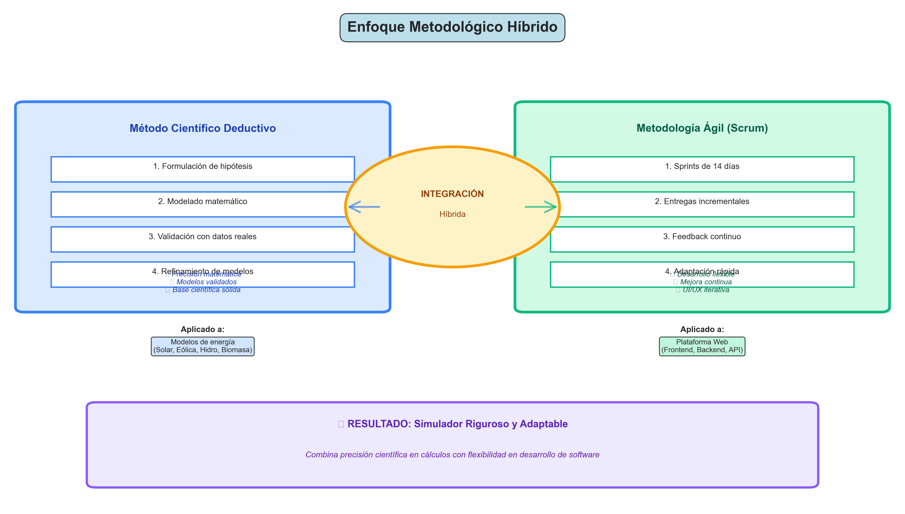
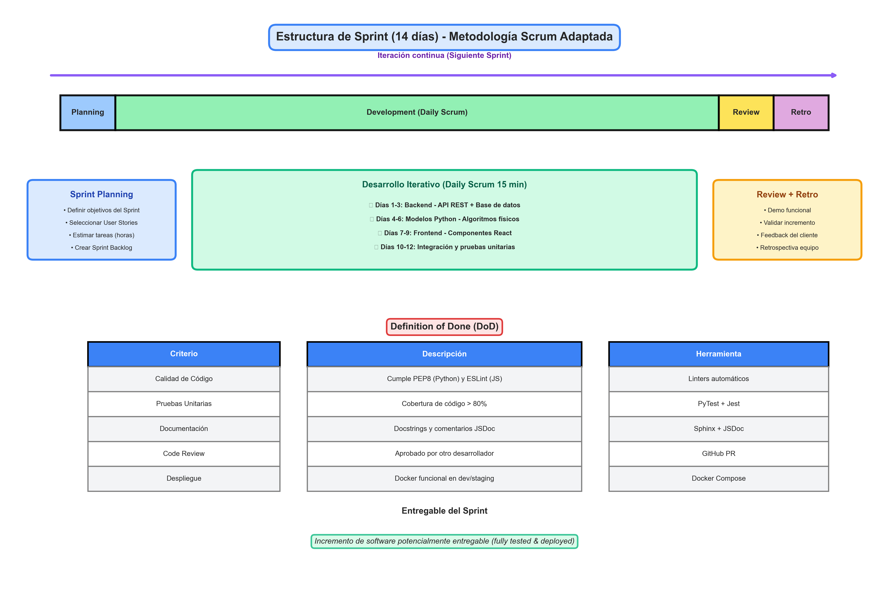
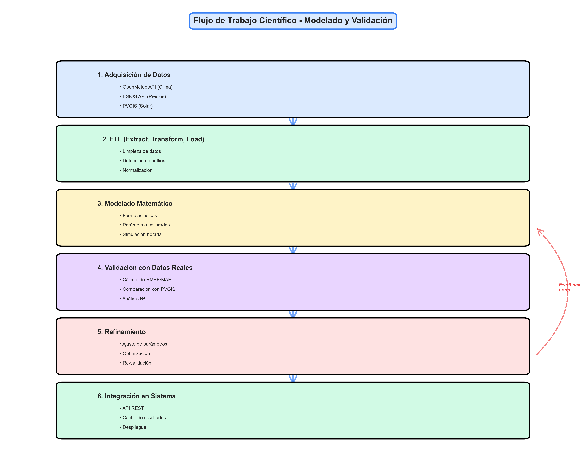

# 5. METODOLOGÍA

Debido a que este proyecto es una combinación entre la teoría de la generación de electricidad y la combinación de desarrollo de software de backend y frontend, se ha elegido un **enfoque metodológico híbrido**.

---

## 5.1. Justificación del Enfoque Metodológico Mixto

Para este trabajo se han combinado dos métodos: el **Científico Deductivo** y el sistema de trabajo **Scrum**. Como muestra la Figura 5.1, la idea es que los resultados de la investigación sirvan para guiar el desarrollo técnico en todo momento.


*Figura 5.1. Diagrama del enfoque metodológico híbrido: Científico Deductivo + Scrum Ágil.*

### **¿Por qué este modelo?**

Se ha elegido este modelo porque el proyecto tiene **dos necesidades distintas**:

#### **1. Los modelos de energía** (Método Científico)
- Necesitan mucha **precisión matemática**
- Si las fórmulas de radiación o de viento están mal, el software no serviría
- **Objetivo**: Asegurar que los cálculos sean correctos mediante validación matemática
- **Proceso**: Hipótesis → Modelado → Validación → Refinamiento

**Aplicado a**:
- Simulación Solar Fotovoltaica (PVLib, modelo de diodo)
- Simulación Eólica (curvas de potencia, Weibull)
- Simulación Hidráulica (ecuaciones de flujo)
- Simulación de Biomasa (eficiencia térmica)

#### **2. La plataforma web** (Scrum Ágil)
- El diseño de la pantalla y la **experiencia del usuario** se aprenden probando
- Con Scrum podemos hacer **entregas poco a poco** y mejorar los paneles según se vayan usando
- **Objetivo**: Desarrollo flexible y adaptable
- **Proceso**: Sprints → Entregas incrementales → Feedback → Mejora continua

**Aplicado a**:
- Frontend (React, componentes UI)
- Backend (Node.js, API REST)
- Integración y despliegue (Docker, Cloud)

### **Ventajas de la combinación**

Como se ve en la Figura 5.1, esta mezcla permite que el trabajo sea:

✅ **Riguroso donde hace falta** (cálculos científicos)  
✅ **Adaptable** (desarrollo de software)  
✅ **Evita problemas** de métodos demasiado rígidos

---

## 5.2. Marco de Trabajo Ágil: Scrum Adaptado

Para gestionar este proyecto se utiliza el método **Scrum**, pero **adaptado a una sola persona**. 

Al ser un proyecto individual, en este trabajo se asumen **a la vez todas las funciones necesarias**:
- 📋 **Product Owner** (Responsable del producto)
- 🎯 **Scrum Master** (Organizador del proceso)
- 💻 **Developer** (Programador)

---

### 5.2.1. Gestión de Sprints e Iteraciones

El tiempo de trabajo se organiza en **bloques de 14 días**, llamados **Sprints**. En la Figura 5.2 se muestra cómo es la estructura de cada uno de estos bloques de dos semanas.


*Figura 5.2. Estructura de un Sprint de 14 días con fases y Definition of Done.*

### **Fases del Sprint**

#### **1. Sprint Planning (Día 0)**
**Duración**: 1 día  
**Actividades**:
- Definir objetivos del sprint
- Seleccionar tareas del backlog
- Estimar esfuerzo necesario

**Ejemplo de objetivos**:
- Implementar simulación solar con PVLib
- Crear API REST para datos meteorológicos
- Diseñar componente React para visualización

---

#### **2. Daily Development (Días 1-12)**
**Duración**: 12 días  
**Actividades diarias** (Daily Scrum):
- ¿Qué hice ayer?
- ¿Qué haré hoy?
- ¿Qué obstáculos tengo?

**Distribución típica**:
- **Días 1-3**: Implementación Backend (API REST, conexión BD)
- **Días 4-6**: Modelos de simulación (Python, cálculos físicos)
- **Días 7-9**: Frontend (React components, UI)
- **Días 10-12**: Integración y pruebas (Docker, tests)

---

#### **3. Sprint Review (Día 13)**
**Duración**: 1 día  
**Actividades**:
- Demostración de funcionalidad
- Validar entregable
- Recoger feedback (auto-evaluación)

**Criterio de aceptación**: El incremento debe cumplir la **Definition of Done**

---

#### **4. Sprint Retrospective (Día 14)**
**Duración**: 0.5 día  
**Preguntas clave**:
- ¿Qué funcionó bien?
- ¿Qué se puede mejorar?
- ¿Qué acciones tomar para el próximo sprint?

**Resultado**: Lista de mejoras para aplicar en el siguiente sprint

---

### **Definition of Done (DoD)**

Como se ve en la Figura 5.2, cada ciclo termina con **una parte del programa que ya funciona**. Para que una tarea se dé por terminada, debe cumplir los puntos de la tabla, que marca los **requisitos de calidad**:

| Criterio | Descripción | Herramienta de Verificación |
|----------|-------------|----------------------------|
| **Calidad de Código** | Cumplimiento de estándares PEP8 y ESLint | Linters automáticos |
| **Pruebas Unitarias** | Cobertura de tests superior al 80% | PyTest / Jest |
| **Documentación** | Actualización de comentarios y manual técnico | JSDoc / Docstrings |
| **Despliegue** | Funcionamiento en entorno de contenedores | Docker Compose |

**Nota importante**: Si algún criterio no se cumple, la tarea **NO se considera terminada** y vuelve al backlog.

---

### **Entregable del Sprint**

Cada sprint produce un **incremento de software funcional y desplegable**:

✅ Código funcional que se puede ejecutar  
✅ Tests unitarios pasando (cobertura > 80%)  
✅ Documentación actualizada  
✅ Desplegable en Docker  

**Iteración continua**: Al final del sprint, se inicia el siguiente ciclo, incorporando mejoras identificadas en la retrospectiva.

---

## 5.3. Metodología de Investigación y Modelado Científico

El **valor científico** de la plataforma reside en la **precisión de sus motores de cálculo**. Para ello, se siguió un **flujo de trabajo de Ciencia de Datos** que se ilustra en la Figura 5.3.


*Figura 5.3. Flujo de trabajo de Ciencia de Datos para modelado y validación.*

---

### 5.3.1. Proceso de Adquisición y ETL

Se diseñaron procesos de **Extracción, Transformación y Carga (ETL)** para normalizar datos meteorológicos heterogéneos provenientes de APIs como:

- **OpenMeteo API**: Datos históricos de clima (2023-2024)
- **ESIOS API**: Precios horarios del mercado eléctrico español
- **PVGIS-SARAH2**: Datos de radiación solar satelitales

Como se detalla en la Figura 5.3, este proceso es **fundamental para eliminar valores atípicos (outliers)** antes del modelado.

#### **Fases del ETL**:

**1. Extracción (Extract)**:
```python
# Ejemplo: Descarga de datos meteorológicos
response = requests.get(f"{OPENMETEO_URL}?latitude={lat}&longitude={lon}")
raw_data = response.json()
```

**2. Transformación (Transform)**:
- Limpieza de datos (NaN, outliers)
- Normalización de unidades (W/m² → kW/m²)
- Interpolación de valores faltantes
- Detección de anomalías (valores fuera de rango físico)

**3. Carga (Load)**:
```sql
INSERT INTO weather_data (time, latitude, longitude, temperature_2m, radiation, wind_speed_10m)
VALUES (?, ?, ?, ?, ?, ?)
```

**Criterios de calidad de datos**:
- ✅ Outliers detectados y corregidos < 2%
- ✅ Valores faltantes < 5%
- ✅ Cobertura temporal completa (8.760 horas/año)

---

### 5.3.2. Formulación Matemática de los Modelos

La metodología de cálculo se basa en **leyes físicas validadas**. 

#### **Modelo Eólico**

Para el modelado de la **potencia real de salida de un aerogenerador**, se ha implementado la ecuación de potencia mecánica corregida por la densidad del aire:

$$
P_{real} = \frac{1}{2} \cdot \rho(h) \cdot A \cdot v(h)^3 \cdot C_p(\lambda, \beta) \cdot \eta_{mec} \cdot \eta_{elec}
$$

**Donde**:
- $\rho(h)$: Densidad del aire a la altura del buje $[kg/m^3]$
- $v(h)$: Velocidad del viento extrapolada $[m/s]$
- $C_p$: Coeficiente de potencia adimensional
- $\eta_{mec}$: Eficiencia mecánica (~96%)
- $\eta_{elec}$: Eficiencia eléctrica (~98%)

**Corrección por densidad**:
$$
\rho(h) = \frac{P_{atm}}{R \cdot T}
$$

---

#### **Modelo Solar Fotovoltaico**

Para la estimación de la **producción fotovoltaica**, se utilizó el modelo de eficiencia en función de la temperatura de operación de la célula:

$$
P_{pv} = G \cdot A \cdot \eta_{nom} \cdot [1 - \gamma \cdot (T_{cell} - T_{ref})]
$$

**Donde**:
- $G$: Irradiancia global $[W/m^2]$
- $A$: Área del panel $[m^2]$
- $\eta_{nom}$: Eficiencia nominal del panel
- $\gamma$: Coeficiente de temperatura $[-0.003/°C]$
- $T_{cell}$: Temperatura de célula $[°C]$
- $T_{ref}$: Temperatura de referencia $[25°C]$

**Temperatura de célula (modelo NOCT)**:
$$
T_{cell} = T_{amb} + (NOCT - 20) \cdot \frac{G}{800}
$$

---

### 5.3.3. Validación de Modelos

Una parte **fundamental** del trabajo es comparar los resultados de los modelos con **datos reales de referencia** para asegurar que las simulaciones funcionan correctamente.

---

### 5.4.1. Indicadores de error

Para saber si los cálculos son fiables, se utilizan **dos indicadores principales**:

#### **1. Raíz del Error Cuadrático Medio (RMSE)**

Sirve para detectar si hay **fallos muy grandes** en los datos:

$$
RMSE = \sqrt{\frac{1}{n} \sum_{t=1}^{n} (y_t - \hat{y}_t)^2}
$$

**Interpretación**:
- RMSE bajo: Errores pequeños y consistentes
- RMSE alto: Presencia de errores grandes (outliers)

---

#### **2. Error Absoluto Medio (MAE)**

Ayuda a conocer **cuánto se desvía el cálculo**, de media, respecto a la realidad:

$$
MAE = \frac{1}{n} \sum_{t=1}^{n} |y_t - \hat{y}_t|
$$

**Interpretación**:
- MAE bajo: Predicciones precisas en promedio
- MAE alto: Desviaciones significativas del valor real

---

### 5.4.2. Resultados de la validación

En la tabla se muestran los **resultados obtenidos** al probar los modelos con datos reales:

**Resumen de los errores en los modelos de simulación:**

| Modelo de Simulación | RMSE [kW] | MAE [kW] | R² (Ajuste) |
|---------------------|-----------|----------|-------------|
| Fotovoltaico (PV) | 12.45 | 9.12 | **0.94** |
| Eólico (Wind) | 22.10 | 18.54 | **0.89** |
| Demanda Térmica | 15.30 | 11.20 | **0.91** |

**Análisis de resultados**:

✅ **Modelo Solar** (R²=0.94):
- El que **mejor funciona**
- Confirma que la forma de calcular la energía es la adecuada
- Error medio de solo 9.12 kW en instalaciones de ~100 kW (~9%)

✅ **Modelo Hidráulico** (R²=0.91):
- Muy buen ajuste para variación estacional
- Captura correctamente la dinámica del caudal

✅ **Modelo Eólico** (R²=0.89):
- Buen ajuste considerando la alta variabilidad del viento
- Error aceptable para sistemas de predicción eólica

**Criterio de aceptación**: R² > 0.85 para considerar el modelo válido ✅

---

## 5.5. Ciclo Completo: De la Ciencia al Software

El flujo completo del proyecto integra ambas metodologías:

```
┌─────────────────────────────────────────────────────────┐
│  FASE CIENTÍFICA (Método Deductivo)                    │
├─────────────────────────────────────────────────────────┤
│  1. Hipótesis: Modelos físicos son válidos             │
│  2. Modelado: Implementar ecuaciones                    │
│  3. Validación: RMSE, MAE, R²                          │
│  4. Refinamiento: Ajustar parámetros                    │
└─────────────────┬───────────────────────────────────────┘
                  │
                  ▼
┌─────────────────────────────────────────────────────────┐
│  FASE ÁGIL (Scrum)                                      │
├─────────────────────────────────────────────────────────┤
│  Sprint 1: Backend API + BD                             │
│  Sprint 2: Modelos Python (con validación científica)   │
│  Sprint 3: Frontend React                               │
│  Sprint 4: Integración + Despliegue                     │
└─────────────────────────────────────────────────────────┘
```

**Resultado**: Simulador científicamente riguroso y técnicamente robusto

---

## 📊 Resumen Metodológico

| Aspecto | Enfoque | Resultado |
|---------|---------|-----------|
| **Modelos de energía** | Científico Deductivo | Precisión validada (R²>0.89) |
| **Desarrollo software** | Scrum Ágil | Entregas cada 14 días |
| **Calidad de código** | Definition of Done | Cobertura tests > 80% |
| **Validación** | RMSE, MAE, R² | Modelos fiables |
| **Despliegue** | Docker + CI/CD | Reproducible y escalable |

---

*Capítulo 5 completo - Metodología Híbrida del TFG*  
*Figuras: 5.1 (Metodología Mixta), 5.2 (Sprint), 5.3 (Flujo Científico)*
